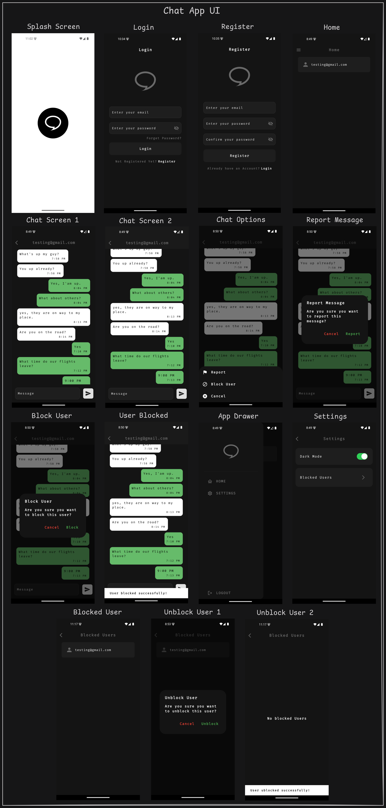

# chat_app

A Flutter application that uses Firebase Firestore to send and receive messages.

## Feature:

The following are the features of this application:

### Change themes

- Switch between light mode and dart mode.

### User Authentication:

- Sign up and log in using email and password.

### Messaging:

- Send and receive messages from other users.
- Message timestamps.

### Report, Block and Unblock user:

- Report messages.
- Block users.
- Unblock users.

### Features to be added in future:

- Message notifications. []
- Change passwords. []
- Password reset via email. []
- Email verification. []
- Delete user account. []


## File Structure:

```bash
assets/
│
├── icon/                   # App Icon
├── images/                 # Chat Bubble Icon
└── screenshots/            # UI Screenshots
lib/
│
├── components/             # Reusable widgets and UI componets from Text Fields to Posts Container
├── util/                   # Chat timestamp function
├── models/                 # Data models for the application
├── pages/                  # UI screens for the application
├── services/               # Firebase service classes (auth_service and chat_service)
│       │
│       ├── auth/           # Firebase Authentication Service
│       └── chat/           # Chat Service
├── themes/                 # Themes Provider and text themes
└── main.dart               # Main entry point of the application
```

## App Icon:

The app icon is made using the following websites:

- [Figma](https://www.figma.com/)
- [App Icon Generator](https://www.appicon.co/)
- [Icon Monstr](https://iconmonstr.com/)


## UI Screens



## Getting Started:

### Prerequisites:

- Have [Flutter](https://flutter.dev/) installed on your machine.
- Create a [Firebase](https://firebase.google.com/) project and turn on Email/Password from the Authentication section in the Sign-in method.

### Packages used:

- 
- 
- 
- 
- 
- 
- 

### Installation:

1. Clone the repository:

```bash
git clone https://github.com/usman619/chat_app.git
cd chat_app
code .
```

2. Install the dependencies:

```bash
flutter pub get
```

3. If you want to change default app icon, goto the file 'flutter_launcher_icons.yaml' and change the path used in 'image_path' and after that run the following command in your terminal:

```bash
dart run flutter_launcher_icons:main
```

4. Login into Firebase Console through CLI and select the project you have created before:

```bash
firebase login
flutter pub global activate flutterfirebase_cli
flutterfire config
< Select the project that you have created in Firebase Console >
flutter pub global deactivate flutterfirebase_cli
```

5. Run using the following command:

```bash
flutter run
```